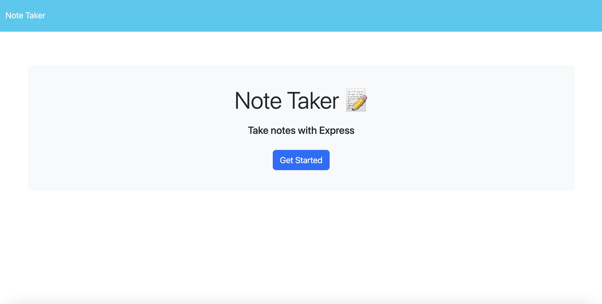
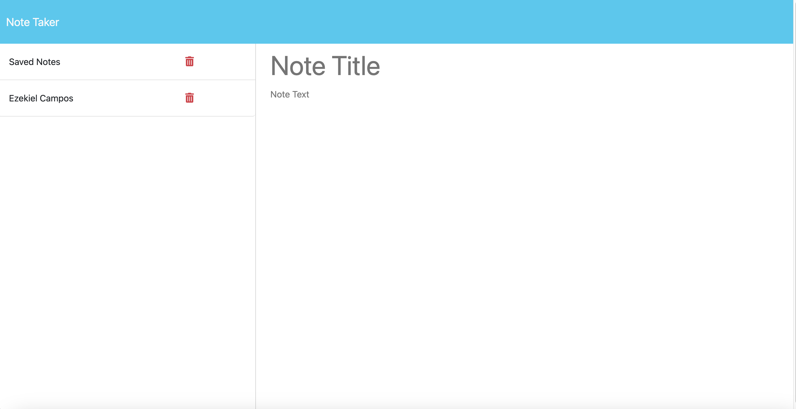

# Creating Note Taker Application Using Express Framework

## Table of Contents
-[Description](#description)
 
-[Installation](#installation)
 
-[Usage](#usage)
 
-[Contributing](#contributing)
 
-[License](#license)
 
-[Tests](#tests)
 
-[Questions](#questions)
 

## Description

This assignment focuses on building a web server for a note taking application using the express framework.  In doing this it gave me a better understanding of how applications are able to send, receive, update, and delete data.  Using the express module I was able to write routes to specific endpoints that did some of the following actions: send html files and data using the get method, and update the database file by adding a note using the post method.  Middleware functions were use to verify if the specified attributes in the req.body were placed inside the object when the post method was called.  While doing this assignment I learned about how important it is to understand the program flow of express, especially when using global middleware.  I modularize most of the routes and certain middleware function to keep my files small and easier to read.  

## Installation

To install this application, go to this GitHub repository copy the all the files.  This file has multiple npm packages needed for this application to run, so if you do not have Node install it before going any further.  To download all the necessary npm packages,  go to the terminal, make sure you’re inside the folder that is holding the files and run the command “npm i”.  This command will look for the package.json file and and will download all the npm modules that are specified in the file.

## Usage

This application is used to create, save and delete notes on the website.  In order to start this application we must start the server inside the repo, before even running this make sure that if you have other servers running exit out of them. The command to run the server is “node server.js”.  Once the server is up and running a message will appear on the command line that will tell you where the port is listening.  If you go to the browser and enter “http://localhost:3001” then if there are no errors it will have taken you the main page.

### Deployed Link
https://note-taker-app-using-express-framework.onrender.com/

### Screenshots

## Contributing

N/A
## License

This repository is covered under the MIT license

## Tests

N/A

## Questions

* GitHub Profile: [EzekielCampos](https://github.com/EzekielCampos)

If you have any additional questions contact me by email at ezcampos603@gmail.com

